# TP Integrador Computación Aplicada

Repositorio grupal del trabajo práctico integrador.


## Integrantes

- Agustin Romero


## Avance del Trabajo

### 1. Configuración del entorno
- [x] Máquina virtual descargada
- [x] Archivos .rar descomprimidos
- [x] VM importada en VirtualBox
- [x] Snapshot inicial creado
- [x] Contraseña root restablecida
- [x] Hostname configurado como TPServer
- [x] Sistema actualizado
- [x] Migración de Debian 11 a Debian 12 realizada

### 2. Servicios
- [x] Servicio SSH instalado
- [x] Servicio SSH verificado
- [x] Acceso SSH remoto funcionando
- [x] Transferencia SCP funcionando
- [x] Autenticación SSH mediante claves configurada
- [x] Apache instalado
- [x] PHP instalado
- [x] Apache + PHP funcionando
- [x] MariaDB instalado
- [x] Base de datos configurada
- [x] Usuario SQL configurado
- [x] Importación de db.sql realizada
- [x] Integración PHP + MariaDB funcionando
- [x] Aplicación web operativa

### 3. Configuración de red
- [x] Conectividad IP verificada
- [x] Repositorios APT corregidos
- [x] IP estática configurada
- [x] Gateway configurado
- [x] DNS configurado
- [x] Acceso HTTP desde máquina física verificado

### 4. Almacenamiento
- [x] Disco adicional de 10 GB agregado
- [x] Particiones Linux creadas
- [x] Filesystems EXT4 creados
- [x] Directorios de montaje configurados
- [x] UUID obtenidos
- [x] Montaje automático mediante fstab configurado
- [x] Migración de archivos web hacia /www_dir realizada
- [x] Apache reconfigurado hacia /www_dir
- [x] Aplicación web funcionando desde nuevo almacenamiento

### 5. Backup
- [ ] Script backup_full.sh desarrollado
- [ ] Validaciones de origen y destino implementadas
- [ ] Opción -help implementada
- [ ] Compresión .tar.gz implementada
- [ ] Backups almacenados en /backup_dir
- [ ] Automatización mediante cron configurada

### 6. Entregables
- [ ] Compresión de directorios solicitados
- [ ] Split de /var realizado
- [ ] README.md finalizado
- [ ] Repositorio GitHub final preparado


## Desarrollo del Trabajo


### 1. Importación de la máquina virtual

Luego de descargar y descomprimir los archivos de la máquina virtual, se procedió a importar el servicio virtualizado en VirtualBox.

Se modificó la configuración de red de la máquina virtual de “Adaptador Puente” a “NAT”, debido a incompatibilidad con la interfaz física configurada originalmente en la imagen importada.

También se creó un snapshot inicial denominado “Estado inicial limpio”, con el objetivo de disponer de un punto de restauración antes de realizar modificaciones en el sistema.


### 2. Recuperación de contraseña root

Debido a que la contraseña del usuario root era desconocida inicialmente, se inició el sistema en modo recuperación mediante GRUB.

Desde el modo recovery se accedió a una shell de mantenimiento con privilegios de administrador.

Se utilizó el comando `passwd` para realizar el blanqueo y cambio de contraseña del usuario root.

La nueva contraseña configurada fue: `palermo`.

Posteriormente se reinició el sistema e inició sesión correctamente con el nuevo password.


#### Comandos utilizados

```bash
passwd
```

#### Evidencia de ejecución del comando passwd

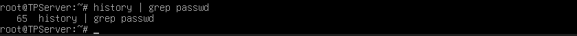


### 3. Configuración de hostname

Se configuró el hostname solicitado en la consigna como `TPServer`.

Para aplicar correctamente los cambios en la sesión actual se ejecutó nuevamente una shell de bash.


#### Comandos utilizados

```bash
hostnamectl set-hostname TPServer

exec bash

hostname
```

### 4. Verificación de conectividad de red

Se verificó el correcto funcionamiento de la interfaz de red y el acceso a internet mediante comandos de diagnóstico de red.

Se comprobó la correcta asignación dinámica de dirección IP, gateway y conectividad hacia internet utilizando NAT.

Inicialmente se detectaron errores al ejecutar `apt update`, debido a repositorios obsoletos configurados en la máquina virtual importada.

Se verificó el funcionamiento de conectividad IP utilizando `ping` hacia direcciones públicas, confirmando acceso a internet pero detectando fallas de resolución hacia los mirrors configurados originalmente.

Para solucionar el problema se editó manualmente el archivo `/etc/apt/sources.list`, reemplazando los repositorios antiguos por mirrors oficiales de Debian Bullseye.

Luego de realizar las modificaciones correspondientes, se ejecutó nuevamente `apt update`, verificando el correcto funcionamiento del gestor de paquetes APT y la conectividad DNS del sistema.


#### Comandos utilizados

```bash
ip a

ip route

ping -c 4 google.com

ping -c 4 8.8.8.8

cat /etc/apt/sources.list

vi /etc/apt/sources.list

apt update
```

#### Evidencia de actualización correcta de repositorios

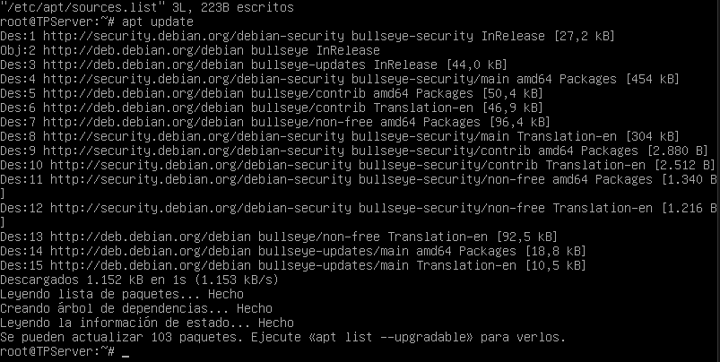


### 5. Actualización de paquetes del sistema

Luego de verificar la conectividad y corregir los repositorios del sistema, se procedió a actualizar los paquetes instalados en Debian 11 Bullseye.

Se ejecutó el comando `apt upgrade -y`, permitiendo descargar e instalar las actualizaciones disponibles para los paquetes ya instalados en el sistema operativo.

Durante el proceso se actualizaron librerías, herramientas del sistema, certificados y componentes internos de Debian, dejando la máquina virtual preparada para continuar posteriormente con la migración a Debian 12.


#### Comandos utilizados

```bash
cat /etc/os-release

apt upgrade -y
```

#### Evidencia de actualización de paquetes

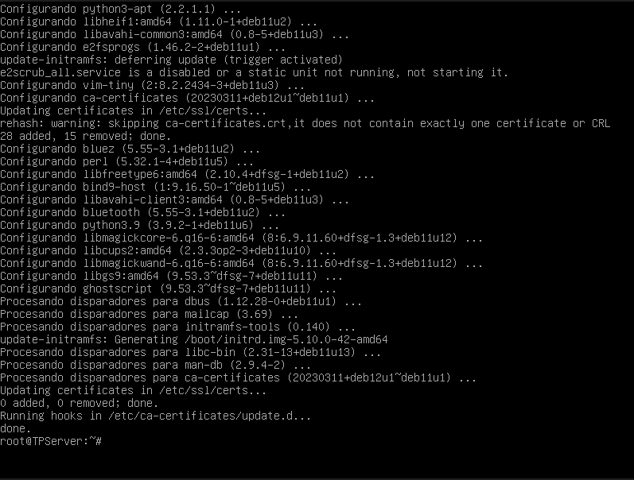


### 6. Migración de Debian 11 a Debian 12

Luego de actualizar completamente los paquetes de Debian 11 Bullseye, se procedió a realizar la migración de distribución hacia Debian 12 Bookworm.

Para ello se modificó el archivo `/etc/apt/sources.list`, reemplazando las referencias de `bullseye` por `bookworm`.

Posteriormente se ejecutó `apt update` para actualizar los índices de paquetes correspondientes a Debian 12.

Finalmente se realizó la actualización completa del sistema mediante `apt full-upgrade -y`, instalando nuevas dependencias, librerías, kernel y componentes internos del sistema operativo.

Durante el proceso se reconfiguró GRUB seleccionando el disco principal `/dev/sda` como dispositivo de instalación del gestor de arranque.

Luego del reinicio del sistema se verificó correctamente el funcionamiento de Debian 12 Bookworm junto con el nuevo kernel Linux 6.1.


#### Comandos utilizados

```bash
cp /etc/apt/sources.list /etc/apt/sources.list.bak

vi /etc/apt/sources.list

apt update

apt full-upgrade -y

reboot

cat /etc/os-release

uname -r
```

#### Evidencia de migración exitosa a Debian 12

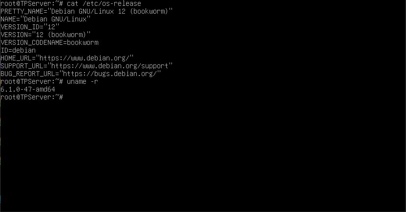

### 7. Instalación y verificación del servicio SSH

Se instaló el servicio OpenSSH Server con el objetivo de permitir la administración remota de la máquina virtual mediante el protocolo SSH.

El servicio SSH permite establecer conexiones remotas seguras utilizando autenticación y cifrado entre cliente y servidor.

Luego de la instalación se verificó el correcto funcionamiento del servicio mediante `systemctl`, comprobando que el daemon `sshd` se encontraba activo y en ejecución.

También se verificó que el servicio se encontrara escuchando conexiones sobre el puerto 22/TCP, correspondiente al puerto estándar utilizado por SSH.


#### Comandos utilizados

```bash
apt install openssh-server -y

systemctl status ssh

ss -tulnp | grep ssh
```

#### Evidencia de servicio SSH activo

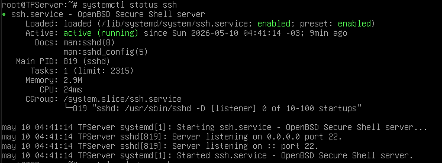

### 8. Configuración de IP estática

Con el objetivo de cumplir los requisitos de conectividad de la consigna, se configuró la interfaz de red de la máquina virtual con una dirección IP estática perteneciente al mismo rango de red de la máquina física.

Inicialmente la interfaz obtenía una dirección dinámica mediante DHCP. Posteriormente se modificó manualmente el archivo `/etc/network/interfaces`, reemplazando la configuración dinámica por parámetros estáticos.

Se configuraron los campos `address`, `netmask`, `gateway` y `dns-nameservers`, estableciendo la dirección IP `192.168.1.50` para la interfaz `enp0s3`.

Luego de aplicar los cambios mediante el reinicio del servicio de red, se verificó el correcto funcionamiento de la conectividad local y el acceso a internet.


#### Comandos utilizados

```bash
ip a

ip route

cat /etc/resolv.conf

vi /etc/network/interfaces

systemctl restart networking

ping -c 4 8.8.8.8
```

#### Evidencia de configuración de IP estática

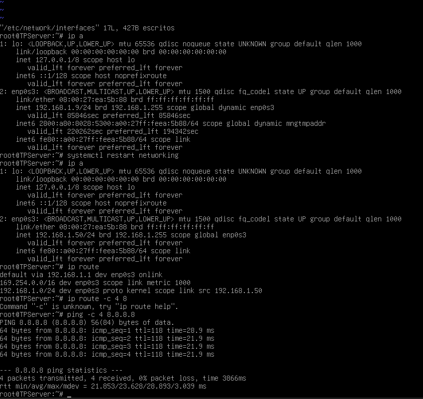

### 9. Transferencia de clave pública mediante SCP

Con el objetivo de configurar la autenticación SSH mediante claves pública/privada, se realizó la transferencia de la clave pública proporcionada en la consigna desde la máquina física Windows hacia la máquina virtual Debian.

Para ello se utilizó el protocolo SCP (Secure Copy Protocol), el cual permite transferir archivos de manera segura utilizando una conexión SSH cifrada.

Previamente se habilitó temporalmente el acceso del usuario `root` mediante contraseña en el archivo `/etc/ssh/sshd_config`, permitiendo establecer la autenticación inicial necesaria para la transferencia del archivo.

La transferencia se realizó correctamente desde PowerShell en Windows hacia el directorio `/root/` de la máquina virtual Debian utilizando la dirección IP estática configurada anteriormente.

Posteriormente se verificó la correcta recepción del archivo `clave_publica.pub` dentro del sistema Linux.


#### Comandos utilizados

```bash
nano /etc/ssh/sshd_config

systemctl restart ssh

scp .\clave_publica.pub root@192.168.1.50:/root/

ls /root
```

#### Evidencia de transferencia SCP de clave pública

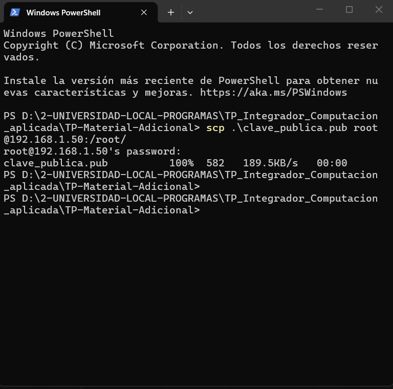

### 10. Configuración de autenticación SSH mediante claves

Con el objetivo de mejorar la seguridad del acceso remoto y cumplir con los requisitos de la consigna, se configuró la autenticación SSH mediante claves pública/privada para el usuario `root`.

Inicialmente se transfirió la clave pública proporcionada en el material adicional hacia la máquina virtual Debian utilizando el protocolo SCP (Secure Copy Protocol).

Posteriormente se creó el directorio `/root/.ssh` y se agregó la clave pública al archivo `authorized_keys`, utilizado por OpenSSH para validar usuarios autorizados mediante criptografía asimétrica.

También se configuraron permisos restrictivos sobre los archivos y directorios relacionados con SSH utilizando `chmod`, debido a que OpenSSH requiere permisos seguros para permitir el uso de claves privadas y públicas.

Desde la máquina física Windows se utilizó la clave privada `clave_privada.txt` para establecer una conexión SSH remota hacia el servidor Debian, verificando el correcto funcionamiento de la autenticación sin necesidad de utilizar contraseña.

Finalmente, una vez validado el acceso mediante claves, se volvió a deshabilitar el acceso remoto de `root` mediante password, dejando habilitada únicamente la autenticación por clave SSH.


#### Comandos utilizados

```bash
mkdir -p /root/.ssh

cat /root/clave_publica.pub >> /root/.ssh/authorized_keys

chmod 700 /root/.ssh

chmod 600 /root/.ssh/authorized_keys

nano /etc/ssh/sshd_config

systemctl restart ssh
```

#### Comandos utilizados desde Windows PowerShell

```powershell
scp .\clave_publica.pub root@192.168.1.50:/root/

ssh -i .\clave_privada.txt root@192.168.1.50
```

#### Evidencia de transferencia SCP de clave pública


#### Evidencia de autenticación SSH mediante clave privada

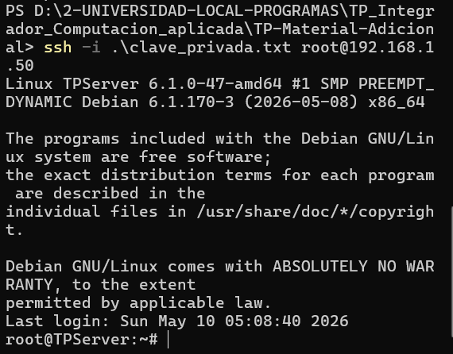

### 11. Instalación y configuración de Apache + PHP

Se instaló el servidor web Apache junto con soporte para PHP, permitiendo ejecutar aplicaciones web dinámicas sobre Debian 12.

Inicialmente se verificó el correcto funcionamiento del servicio Apache mediante `systemctl status apache2`, confirmando que el servidor HTTP se encontraba activo y escuchando conexiones entrantes sobre el puerto 80.

Posteriormente se comprobó el acceso desde la máquina física Windows mediante navegador web, verificando la correcta visualización de la página por defecto de Apache.

Luego se copiaron los archivos `index.php` y `logo.png` desde el directorio `/root` hacia `/var/www/html`, correspondiente al directorio web utilizado por Apache para publicar contenido HTTP.

Finalmente se eliminó el archivo `index.html` predeterminado de Apache para permitir que el servidor utilice automáticamente `index.php` como página principal del sitio.


#### Comandos utilizados

```bash
apt install apache2 php libapache2-mod-php -y

systemctl status apache2

cp /root/index.php /var/www/html/

cp /root/logo.png /var/www/html/

rm /var/www/html/index.html
```

#### Evidencia de servicio Apache activo

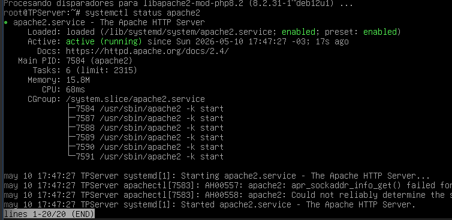

#### Evidencia de acceso HTTP desde navegador

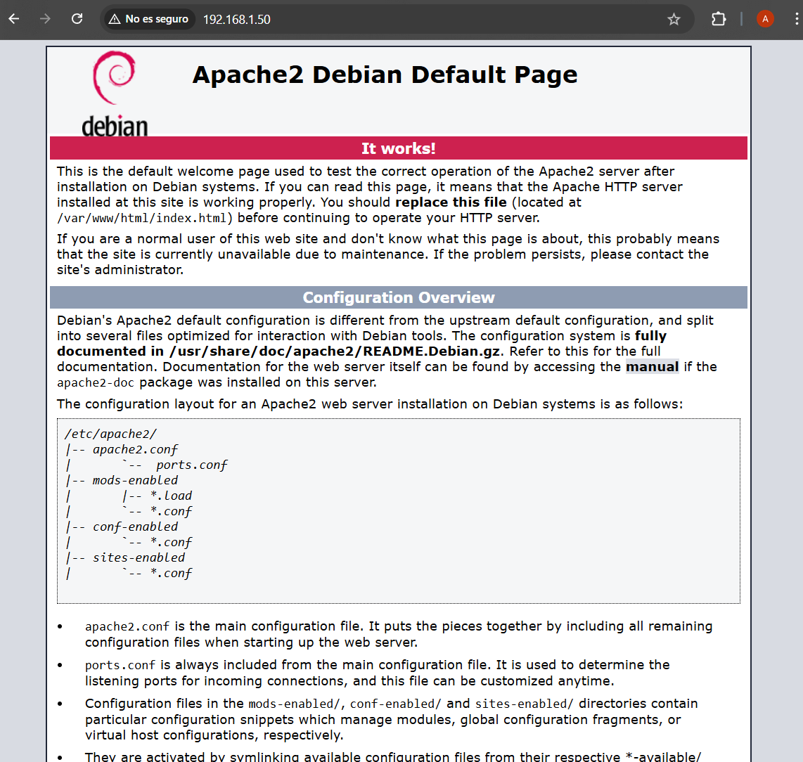

#### Evidencia de configuración de archivos web

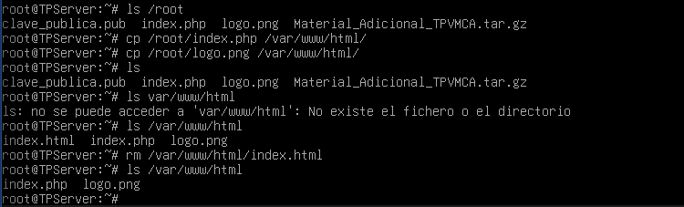

#### Evidencia inicial de ejecución PHP antes de configurar MariaDB


### 12. Instalación y configuración de MariaDB

Se instaló y configuró MariaDB como motor de base de datos para la aplicación web desarrollada en PHP.

Inicialmente se verificó el correcto funcionamiento del servicio utilizando `systemctl status mariadb`, confirmando que el motor SQL se encontraba activo y preparado para recibir conexiones.

Posteriormente se creó la base de datos `ingenieria`, junto con el usuario `lcars`, configurando la contraseña y asignando permisos completos sobre la base de datos mediante instrucciones SQL.

Luego se importó el archivo `db.sql`, el cual contenía la estructura de tablas y registros necesarios para el funcionamiento de la aplicación web.

Durante las pruebas iniciales de funcionamiento, la aplicación web mostró una pantalla en blanco debido a la ausencia del módulo `mysqli` dentro de PHP. Posteriormente se verificó el error consultando el archivo `/var/log/apache2/error.log`, identificando el mensaje `Class "MySQLi" not found`.

Para solucionar el problema se instaló el paquete `php-mysql` y se reinició el servicio Apache, habilitando correctamente la comunicación entre PHP y MariaDB.

Finalmente se verificó el correcto funcionamiento de la integración Apache + PHP + MariaDB accediendo desde la máquina física Windows al sitio web publicado por Apache, observando correctamente la tabla de alumnos obtenida desde la base de datos.


#### Comandos utilizados

```bash
apt install mariadb-server php-mysql -y

systemctl status mariadb

mysql
```

#### Comandos SQL utilizados

```sql
CREATE DATABASE ingenieria;

CREATE USER 'lcars'@'localhost' IDENTIFIED BY 'NCC1701D';

GRANT ALL PRIVILEGES ON ingenieria.* TO 'lcars'@'localhost';

FLUSH PRIVILEGES;
```

#### Importación de base de datos

```bash
mysql

USE ingenieria;

SOURCE /root/db.sql;
```

#### Diagnóstico de errores PHP

```bash
tail -n 40 /var/log/apache2/error.log
```

#### Instalación de soporte MySQL para PHP

```bash
apt install php-mysql -y

systemctl restart apache2
```

#### Evidencia de servicio MariaDB activo

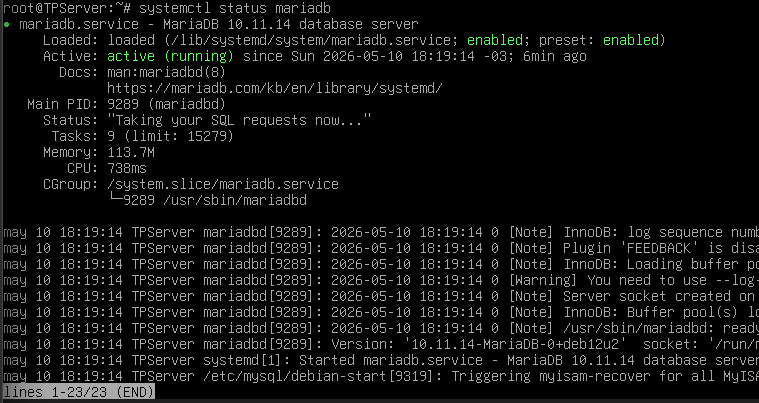

#### Evidencia de configuración de base de datos y usuario SQL

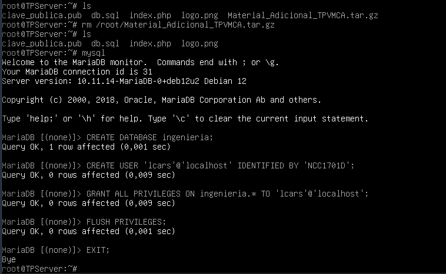

#### Evidencia final de aplicación web funcionando

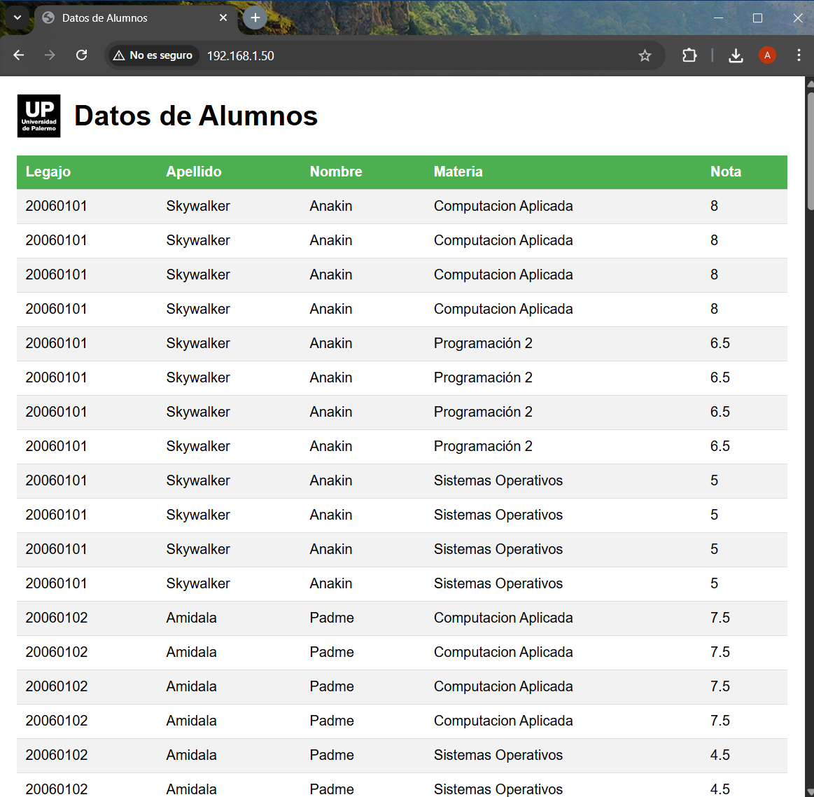

### 13. Configuración de almacenamiento adicional

Con el objetivo de separar los datos del sistema de los datos correspondientes a la aplicación web y los backups, se agregó un nuevo disco virtual de 10 GB a la máquina virtual Debian utilizando VirtualBox.

Posteriormente se verificó la detección del nuevo dispositivo mediante herramientas de administración de discos de GNU/Linux, identificándose el nuevo disco como `/dev/sdc`.

Sobre este nuevo disco se crearon dos particiones estándar tipo Linux:

- `/dev/sdc1` → destinada al directorio `/www_dir`
- `/dev/sdc2` → destinada al directorio `/backup_dir`

Las particiones fueron formateadas utilizando el sistema de archivos EXT4 y posteriormente montadas dentro del sistema operativo.

También se configuró el archivo `/etc/fstab` utilizando UUID para garantizar el montaje automático de ambas particiones al iniciar el sistema operativo.

Finalmente, el contenido del sitio web Apache (`index.php` y `logo.png`) fue migrado desde `/var/www/html` hacia `/www_dir`, y Apache fue reconfigurado para utilizar esta nueva ubicación como `DocumentRoot`.


#### Verificación de detección del nuevo disco

```bash
lsblk
```

#### Evidencia de nuevo disco detectado

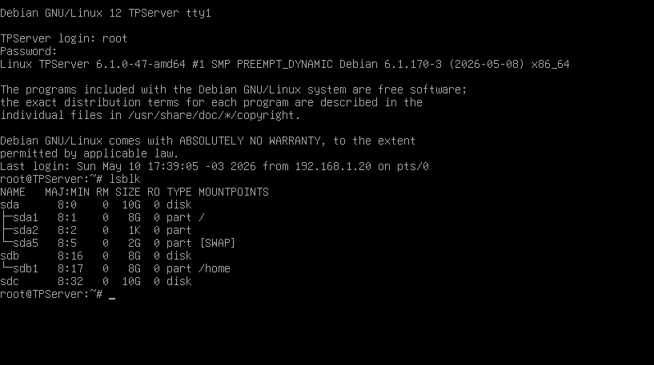


#### Creación de particiones en el nuevo disco

```bash
fdisk /dev/sdc
```

Particiones creadas:

- `/dev/sdc1` → 3 GB
- `/dev/sdc2` → 6 GB

#### Evidencia de particiones creadas

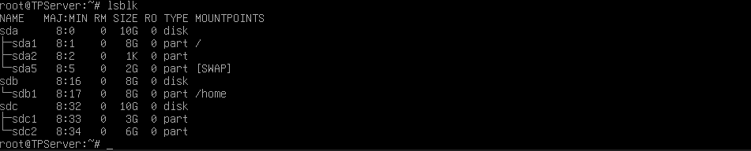


#### Formateo de particiones EXT4

```bash
mkfs.ext4 /dev/sdc1

mkfs.ext4 /dev/sdc2
```

#### Evidencia de creación de filesystems EXT4

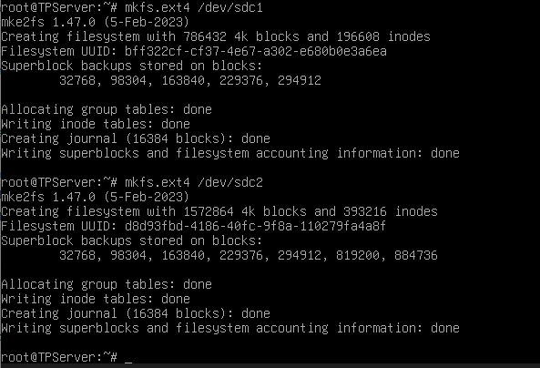


#### Creación de directorios de montaje

```bash
mkdir /www_dir

mkdir /backup_dir
```

#### Montaje manual de particiones

```bash
mount /dev/sdc1 /www_dir

mount /dev/sdc2 /backup_dir
```

#### Evidencia de particiones montadas

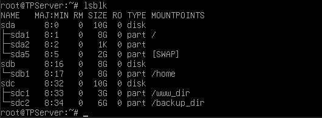


#### Obtención de UUID de particiones

```bash
blkid
```

#### Evidencia de UUID generados

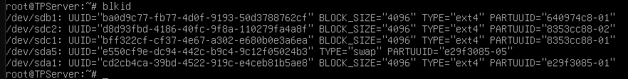


#### Configuración de montaje automático mediante fstab

Archivo editado:

```bash
nano /etc/fstab
```

Entradas agregadas:

```fstab
UUID=bff322cf-cf37-4e67-a302-e680b0e3a6ea /www_dir ext4 defaults 0 2
UUID=d8d93fbd-4186-40fc-9f8a-110279fa4a8f /backup_dir ext4 defaults 0 2
```

#### Validación de configuración fstab

```bash
mount -a
```

#### Evidencia de montaje automático funcionando

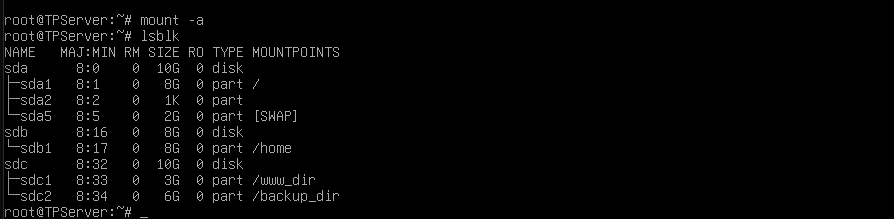


#### Migración de archivos web al nuevo almacenamiento

```bash
mv /var/www/html/index.php /www_dir/

mv /var/www/html/logo.png /www_dir/
```

#### Verificación de archivos migrados

```bash
ls /www_dir
```

#### Evidencia de archivos web movidos

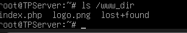


#### Reconfiguración de Apache hacia /www_dir

Archivo editado:

```bash
nano /etc/apache2/sites-available/000-default.conf
```

Cambio realizado:

```apache
DocumentRoot /www_dir
```

#### Evidencia de cambio de DocumentRoot

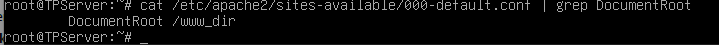


#### Configuración de permisos Apache sobre /www_dir

Archivo editado:

```bash
nano /etc/apache2/apache2.conf
```

Configuración agregada:

```apache
<Directory /www_dir>
    Options Indexes FollowSymLinks
    AllowOverride None
    Require all granted
</Directory>
```

#### Validación de configuración Apache

```bash
apache2ctl configtest
```

Resultado obtenido:

```text
Syntax OK
```

#### Reinicio de Apache

```bash
systemctl restart apache2
```

#### Evidencia de Apache funcionando con nuevo almacenamiento

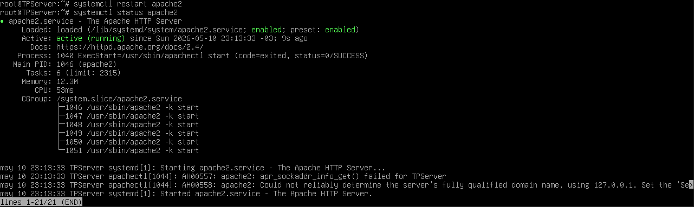


#### Evidencia final de aplicación web funcionando desde /www_dir

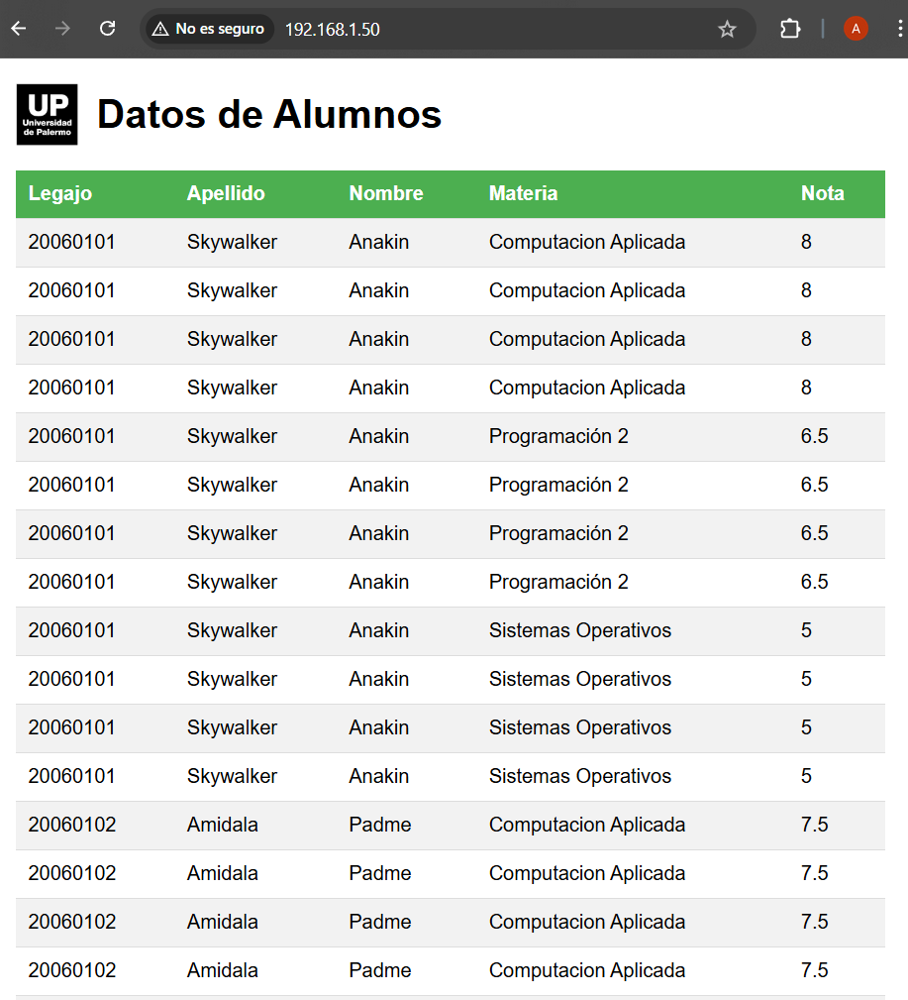